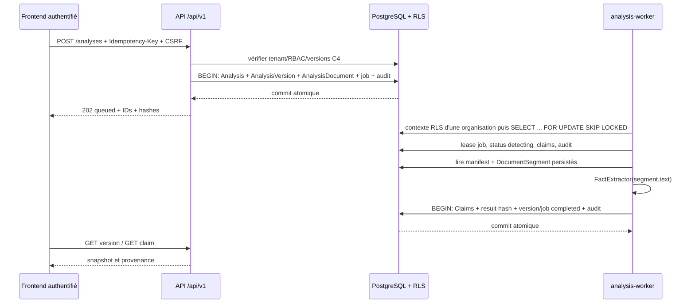

# Chantier 5 — Dossiers d’analyse versionnés et détection déterministe de claims

## Objet et frontière de produit

Le Chantier 5 ajoute un parcours asynchrone et durable pour détecter des passages environnementaux citables dans les **segments déjà extraits** d’une version documentaire C4.

Il s’agit d’un outil de pré-audit et de gestion du risque. Une détection est un fait lexical à relire dans la source, **pas** un avis juridique, une décision réglementaire, une certification ou une validation de preuve.

### Inclus

- `Analysis` logique tenant-scoped et `AnalysisVersion` numérotées ;
- manifest d’entrée canonique et hashé ;
- job PostgreSQL durable `analysis_detection_jobs`, lease, reprise et retries bornés ;
- réemploi de `FactExtractor`, segment par segment ;
- `Claim` lié à un `DocumentSegment`, avec page, offsets, trigger, hash source et provenance ;
- statut `review_required` pour les claims provenant d’un segment OCR ;
- API RBAC/CSRF, idempotence et événements d’audit ;
- worker séparé `analysis-worker` et UX minimale depuis une version documentaire extraite.

### Hors périmètre explicite

- appel de `InferenceEvaluator`, application de règles ou verdict réglementaire persistant ;
- score juridique ou score de confiance inventé ;
- rapprochement automatique claim → preuve, risque, recommandation ou validation ;
- LLM, RAG, déduplication sémantique, extraction structurée de tableaux ;
- rapport PDF.

`AnalysisVersion.overall_risk_level` et `risk_score` sont `NULL` pour les versions C5 : ce parcours ne persiste donc aucune évaluation de risque ou conclusion juridique.

## Préconditions et entrée immuable

`POST /api/v1/analyses` accepte une liste non vide et non dupliquée de `document_version_ids` appartenant à l’organisation active. Chaque version doit être :

1. visible dans le tenant ;
2. rattachée à un document non supprimé ;
3. dans l’état d’extraction `completed` ou `review_required` ;
4. dotée d’un transcript extrait hashé.

L’API construit un manifeste JSON canonique contenant, par version :

- IDs document/version et numéro de version ;
- nom source, hash binaire, hash du transcript et moteur d’extraction ;
- statut d’extraction, langue, nombre de segments et hash canonique de leur snapshot (ID, page, type, offsets, hash du texte et hash source).

`input_manifest_sha256 = sha256(canonical_json(manifest))`. Le manifeste est conservé dans `result_json` dès la mise en file afin que le worker traite le snapshot demandé, et non une sélection documentaire modifiée ultérieurement.

## Cycle transactionnel

Aucun octet brut n’est relu depuis MinIO/S3 dans ce chantier. L’analyse consomme uniquement les `DocumentSegment` C4 tenant-scoped et contrôle que leurs hashes correspondent encore au manifeste/version immuable.

## Idempotence et versioning

### Création

L’en-tête `Idempotency-Key` est obligatoire (1–128 caractères ASCII imprimables sans espace). L’empreinte de requête lie :

- l’opération `analysis_create` ;
- les IDs de versions triés ;
- le contexte `analysis_key`, fournisseur et produit éventuels.

`AnalysisVersion` porte `organization_id`, `idempotency_key` et `request_sha256`, avec unicité `(organization_id, idempotency_key)`.

- même clé + même empreinte → même `Analysis` / `AnalysisVersion` / job, réponse `202` avec `idempotent_replay=true` ;
- même clé + empreinte différente → `409` ;
- course concurrente → contrainte SQL unique et récupération sûre du résultat déjà créé.

### Relance

`POST /analyses/{analysisId}/retry` exige aussi une clé. Il ne requeue jamais une version terminée ou échouée : il crée une version `n + 1`, un nouveau manifeste, un nouveau job et des événements d’audit. Une version active ne peut pas être relancée en parallèle.

Les claims, manifeste et `result_sha256` d’une version `completed` ne sont pas modifiés. Toute publication détecte aussi l’existence inattendue de claims et refuse l’écrasement (`claims_already_published`).

## Queue durable et reprise

`analysis_detection_jobs` est tenant-scoped et comporte notamment :

- `status`: `queued`, `running`, `completed`, `failed` ;
- `attempt_count`, `max_attempts`, `available_at` ;
- `locked_at`, `lease_expires_at`, `worker_id` ;
- `started_at`, `completed_at`, `error_code`.

L’index `(organization_id, status, available_at)` permet le claim par organisation. Le worker énumère uniquement le répertoire global des organisations actives, pose le contexte RLS avec `set_db_request_context`, puis réclame au plus un job dans cette portée. Il n’utilise ni bypass RLS global, ni Redis/Celery/RabbitMQ.

Un lease expiré est replanifié si le budget le permet ; sinon la version devient `failed`, reçoit un résultat d’échec hashé et l’événement d’audit correspondant. Les erreurs terminales (manifest/segment source incohérent, publication non sûre) ne sont pas répétées ; les erreurs techniques inattendues utilisent le backoff exponentiel borné.

Configuration :

| Variable | Défaut | Rôle / borne |
|---|---:|---|
| `ANALYSIS_DETECTION_MAX_ATTEMPTS` | `3` | 1 à 10 tentatives par cycle |
| `ANALYSIS_DETECTION_RETRY_BASE_SECONDS` | `30` | base du backoff exponentiel |
| `ANALYSIS_DETECTION_LEASE_SECONDS` | `300` | 30 à 900 secondes |
| `ANALYSIS_DETECTION_POLL_SECONDS` | `2` | cadence minimale du worker |

## Provenance d’un claim

Pour chaque fait retourné par `FactExtractor`, le worker crée un `Claim` :

- `analysis_version_id` et `document_segment_id` ;
- type/catégorie lexicale et texte de la phrase ;
- offsets de phrase dans le transcript canonique ;
- `source=deterministic`, `detector_version=vericlaim-fact-extractor-v1` ;
- `confidence_score=NULL` ;
- `status=detected`, ou `review_required` si `segment_type=image_ocr`.

`attributes_json` conserve notamment les offsets locaux et globaux du trigger/phrase, la négation, les signaux lexicaux, les éventuels chiffres, les IDs document/version/segment, la page, les bornes du segment et les SHA-256 source/segment. Le `result_json` final porte une copie canonique des claims et `result_sha256`, ce qui ancre le snapshot relationnel dans le résultat hashé.

## Sécurité, RLS et RBAC

- migration `f6a2d9b41c07_durable_analysis_claim_detection` crée le job et applique `ENABLE/FORCE ROW LEVEL SECURITY` avec `p_analysis_detection_jobs_tenant` sous PostgreSQL ;
- toutes les requêtes métier filtrent explicitement `organization_id`, y compris sur SQLite de test ;
- `POST /analyses` et `/retry` exigent `audit:run` + session active + CSRF ;
- lectures d’analyse/version/claim exigent `audit:read` ;
- `organization_id` ne provient jamais du client ;
- les événements `analysis.created`, `analysis.claim_detection_queued`, `started`, `completed`, `failed`, lease/retry sont append-only et hash-chaînés via `AuditEvent` ;
- le CORS autorise explicitement `Idempotency-Key` afin que le navigateur puisse envoyer les mutations idempotentes avec cookies.

## Endpoints livrés

| Route | Réponse | Permission |
|---|---|---|
| `POST /api/v1/analyses` | `202` + analyse/version/job | `audit:run`, CSRF, `Idempotency-Key` |
| `GET /api/v1/analyses/{id}` | dossier et résumés de versions | `audit:read` |
| `GET /api/v1/analyses/{id}/versions/{n}` | snapshot, job, claims et citations | `audit:read` |
| `GET /api/v1/claims/{id}` | claim et provenance de segment | `audit:read` |
| `POST /api/v1/analyses/{id}/retry` | `202` + nouvelle version/job | `audit:run`, CSRF, `Idempotency-Key` |

## Vérifications automatisées

`tests/test_persistent_analyses.py` couvre :

- création durable, traitement par worker séparé et statut final ;
- liens claim → segment, page, offsets et hashes ;
- refus d’un snapshot de segments qui ne correspond plus au manifeste hashé ;
- `review_required` OCR et absence de score de confiance ;
- idempotence, collision de clé et nouvelle version de relance ;
- refus des versions pending/étrangères ;
- routes `202`, RBAC/CSRF, manifeste et lecture de snapshot.

Les tests d’architecture vérifient la table tenant-owned, la migration et la policy RLS rendue en SQL PostgreSQL.
